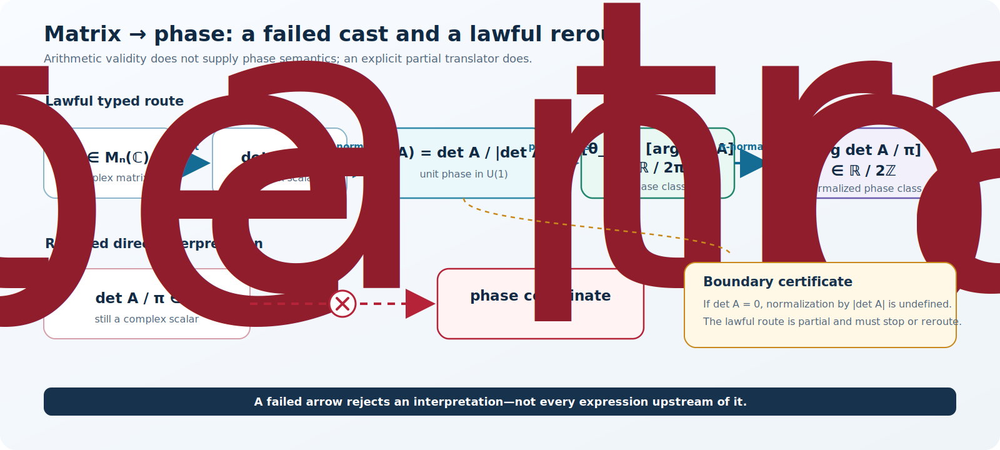
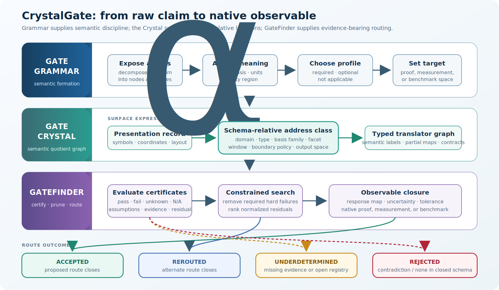
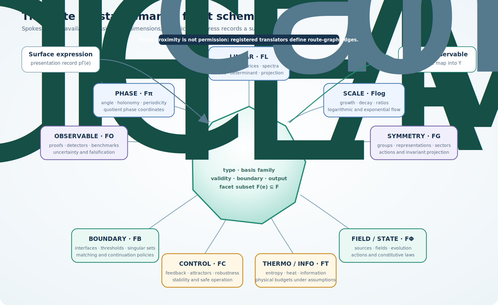
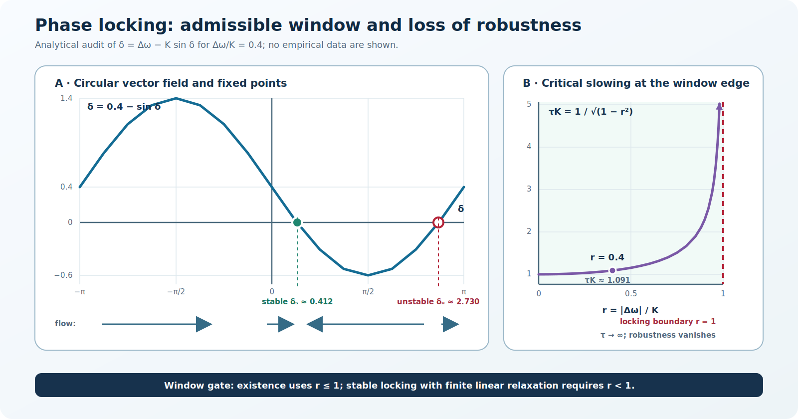

# CrystalGate: A Typed Gate Calculus for Lawful Mathematical Transformation and Observable-Driven Inference

**Article type:** *Methodological framework and theory/protocol paper*  
**Running title:** *A Typed Gate Calculus for Lawful Mathematical Transformation and Observable-Driven Inference*  
**Author:** *Derrick Covington*  
**Affiliation:** *Green The Dream Research Lab, Independent Researcher, United States*  
**Author Email:** *derrick@greenthedream.com*  
**Date:** 18 July 2026<br>
**Preprint DOI:** [10.13140/RG.2.2.35795.34082](https://doi.org/10.13140/RG.2.2.35795.34082)

**Repository resources:** [ResearchGate preprint](https://doi.org/10.13140/RG.2.2.35795.34082) · [PDF](<CrystalGate-A Typed Gate Calculus for Lawful Mathematical Transformation and Observable-Driven Inference.pdf>) · [DOCX manuscript](<CrystalGate-A Typed Gate Calculus for Lawful Mathematical Transformation and Observable-Driven Inference.docx>) · [Executable GateFinder artifact](artifacts/minimal_gatefinder/README.md)

---

## Abstract

Formal and applied arguments can be locally well formed yet globally unsound. Failure often lies in a hidden arrow: an undeclared type change, inadmissible basis, missing law, untested validity window, unpaid cost, or absent observation map. We introduce the **CrystalGate Mathematical Grammar** (CGMG), a typed routing calculus that makes such transitions explicit and auditable. A claim is represented as a directed graph whose nodes carry schema-relative semantic addresses and whose edges are partial, typed translators. Twelve families of evidence-bearing gates evaluate object identity, basis, source, law, window, transition, compatibility, budget, stability, accounting, boundary treatment, and observable closure. Hard gates report whether feasibility predicates are satisfied; soft gates report successful evaluation and a normalized residual, without implying that the mismatch is small. Required hard failures remove routes; soft residuals rank surviving routes; missing evidence yields an underdetermined result. GateFinder returns accepted, rejected, rerouted, or underdetermined at a declared validity level. We define a semantic quotient Gate Crystal and a target-specific weighted lift, formulate representation covariance, and derive internal consistency results for structural type preservation, verdict invariance, and minimum-cost routing under explicit assumptions. Illustrative audits treat matrix-induced phase, oscillator locking, GPU graph optimization, and a cross-scale epidemiological claim. A dependency-free reference artifact executes six prespecified synthetic claims and emits complete route and certificate records. CrystalGate neither replaces domain mathematics nor constitutes a physical unification theory. It is a testable framework for reducing category errors, exposing proof obligations, and connecting formal transformations to native adjudication outputs.

**Keywords:** typed mathematical reasoning; formal methods; scientific inference; model validation; graph routing; observability

### Research highlights

- Claims are modeled as typed graphs rather than isolated symbolic strings.
- Consequential arrows require translators, preconditions, and evidence.
- Domain profiles separate shared gates from inapplicable assumptions.
- Required hard gates set admissibility; soft residuals guide rerouting.
- Accepted applied routes terminate in declared native outputs.
- A reference implementation emits auditable manifests for six synthetic cases.

> **Scope statement.** CrystalGate is a meta-level framework for constructing, auditing, and routing models. Its propositions are structural consistency results internal to the declared calculus, not claims of empirical correctness or major standalone mathematical theorems. Whether the calculus improves real scientific or engineering decisions is an empirical question addressed by the evaluation program in Section 10.

---

## 1. Introduction

### 1.1 The hidden-arrow problem

Formal notation can create an illusion of continuity. If two meaningful expressions are written on adjacent lines, the reader may unconsciously grant the arrow between them:

```math
e_0 \longrightarrow e_1.
```

Yet the validity of $e_0$ and the validity of $e_1$ do not establish the validity of the transformation. The arrow may silently convert a determinant into a phase, a correlation into a cause, a symmetry label into a force law, a dynamically possible state into a controllable one, or a theoretical quantity into a measurement without a response model. Such errors are not necessarily syntactic. They are **routing errors**: failures to show that the source expression, transformation, operating regime, and target expression belong to one admissible chain.

The central thesis of CrystalGate is therefore narrower—and more operational—than a universal equation:

```math
\boxed{ \text{Local well-formedness does not imply global admissibility.} }
```
<p align="right"><em>(1)</em></p>

An expression is admitted to a routed argument only when its semantic type and basis are declared, every nontrivial transition is witnessed, all applicable constraints are discharged, and the route exits in the language of the domain's proof or measurement practice.

Three levels of validity are kept separate throughout:

- **syntactic well-formedness:** the expression is legal in a formal language;
- **semantic well-formedness:** the expression and its transitions have a declared interpretation under the selected domain schema; and
- **empirical adequacy:** the resulting prediction agrees with observation under a prespecified uncertainty and comparison model.

A route may pass one level and fail the next. CrystalGate is designed to report that boundary rather than collapse all three into the word “valid.”

The corresponding workflow is

```math
\text{claim} \rightarrow \text{decomposition} \rightarrow \text{typing} \rightarrow \text{translator search} \rightarrow \text{gate certificates} \rightarrow \text{native observable}.
```
<p align="right"><em>(2)</em></p>

This formulation treats mathematical reasoning in a compiler-like way. Expressions have semantic types; translators resemble typed transformations; gates resemble proof obligations and interface contracts; residuals resemble diagnostics; and observables are the output interface. The analogy is useful because it distinguishes a valid expression from a valid use of that expression.

### 1.2 Research question

The primary research question is:

> Can an evidence-bearing, typed routing calculus detect invalid mathematical transitions, recover valid alternate routes, and improve the traceability of claims from formal expression to native observable?

This question is falsifiable. CrystalGate would provide little value if it were representation dependent, rejected established valid transformations, performed no better than a short checklist, or generated route scores unrelated to observed failure.

### 1.3 Contributions

This article makes six contributions.

1. **Typed claim graphs.** A claim is decomposed into nodes and explicit arrows, each interpreted in a domain context.
2. **Schema-relative semantic addresses.** Expressions are located by type, admissible basis family, facet, validity region, boundary policy, and observable codomain rather than by surface notation.
3. **Partial translators.** Cross-basis and cross-type maps carry preconditions, postconditions, invariants, uncertainty, cost, and evidence.
4. **Evidence-bearing gates.** A domain-selected family of twelve validators returns four-valued status, residual, and provenance rather than a bare Boolean.
5. **Constrained routing.** GateFinder removes required hard-failed paths and selects among admissible paths using normalized costs and residuals.
6. **Observable closure.** Acceptance of a scientific or engineering route requires an explicit map into a native measurement or benchmark space.

The individual ingredients have clear precedents in dimensional analysis, type systems, formal verification, graph algorithms, control theory, and scientific provenance. The proposed contribution is their synthesis into an observable-terminated calculus for multidisciplinary claims.

### 1.4 What is—and is not—claimed

CrystalGate does not claim that all phenomena reduce to one substance, one equation, or one preferred coordinate system. It does not infer physical laws from notation, and it does not turn analogies into mechanisms. It instead proposes that some forms of unification are grammatical: domains can share a discipline for declaring what objects are, which transformations are permitted, what conditions make those transformations valid, and what observations could prove them wrong.

Throughout this article, **lawful** means admissible relative to a declared schema $\Sigma$, context $\Gamma$, requested validity level, and registered contracts. It does not mean universally true or physically realized.

The formal results in Section 6 are deliberately labeled **structural propositions**. They verify that the definitions compose as claimed when their hypotheses hold. Several are near-direct consequences of those hypotheses; for example, verdict invariance assumes preservation of the decision-relevant graph, translators, certificates, response maps, and adjudication rules. Their value is to expose the exact invariants an implementation must preserve, not to establish empirical adequacy or to displace deeper results in type theory, verification, graph transformation, or scientific inference.

The term *geometry* is used in a precise combinatorial sense. The Gate Crystal is a typed directed quotient multigraph of semantic address classes. No Euclidean metric, differentiable structure, or physical crystal is assumed.

### 1.5 Three-part architecture

The canonical system architecture has three parts:

1. **Gate Grammar** supplies types, lawful basis families, gate profiles, and the rules governing admissible expressions.
2. **Gate Crystal** organizes schema-relative semantic address classes and registered translators as a typed graph.
3. **GateFinder Protocol** evaluates certificates, prunes or repairs routes, and connects a surviving route to a native output.

These are architectural components, not three stages that every analysis must traverse only once. GateFinder may return to the grammar when an object is ambiguous or refine a Crystal address when a quotient class is too coarse.

---

## 2. A running example: from a matrix to a phase

Consider the statement

```math
\frac{\det A}{\pi}\quad\text{is a phase coordinate}.
```
<p align="right"><em>(3)</em></p>

For $A\in M_n(\mathbb C)$, the expression in (3) is arithmetically defined. That does not make its interpretation as phase valid. The determinant is a complex scalar; division by the real constant $\pi$ remains scalar multiplication. No semantic transition to $U(1)$ or to the quotient $\mathbb R/2\pi\mathbb Z$ has occurred.

A lawful route is instead

```math
A\xrightarrow{\det}\det A\xrightarrow{\text{phase normalization}}u(A)=\frac{\det A}{\lvert\det A\rvert}\in U(1).
```
<p align="right"><em>(4)</em></p>

Writing $u(A)=e^{i\theta_A}$ defines an intrinsic phase class

```math
[\theta_A]\in\mathbb R/2\pi\mathbb Z,
```

and hence a $\pi$-normalized coordinate

```math
\left[\frac{\theta_A}{\pi}\right]\in\mathbb R/2\mathbb Z.
```
<p align="right"><em>(5)</em></p>

The translator in (4) has precondition $\det A\ne0$, so its lawful matrix domain is $GL_n(\mathbb C)$. It is undefined on the singular set, which activates a boundary obligation rather than being silently admitted. The example makes five points at once:

- numerical divisibility is not semantic permission;
- a linear object can lawfully induce a phase;
- the inducing map must be stated;
- the map's domain matters;
- a rejected direct route can be repaired by rerouting.

Figure 1 contrasts the failed cast with the explicit partial route and its singular boundary.



**Figure 1. Invalid and lawful matrix-to-phase routes.** Division by $\pi$ does not change semantic type. Determinant, normalization into $U(1)$, passage to a phase class, and $\pi$-normalization provide the required translators. The normalization is undefined at $\det A=0$.

The final map is the quotient-group isomorphism

```math
\varphi_\pi: \mathbb R/2\pi\mathbb Z \longrightarrow \mathbb R/2\mathbb Z, \qquad [\theta]_{2\pi}\longmapsto[\theta/\pi]_2.
```

For this reason, the technical phrase **$\pi$-normalized phase class** is preferred here to “base-$\pi$.” The latter can be mistaken for a positional numeral system, which is not what the construction denotes.

---

## 3. Relationship to established methods

CrystalGate is intentionally connective. Its components resemble established methods, but their roles in the present framework are distinct.

### 3.1 Dimensional and type discipline

Dimensional analysis blocks equations whose physical dimensions are inconsistent [1]. Dimension-aware type systems extend this protection into executable programs [2]. CrystalGate generalizes the same design instinct from units to semantic roles: a dimensionless scalar is not automatically a phase, probability, character, entropy, or control signal. Dimensional validity is therefore necessary in many physical routes but not sufficient for semantic validity.

Restricted dependent type systems allow value-level constraints to enter type judgments [3]. CGMG borrows this idea through validity regions such as $\lvert\Delta\omega\rvert<K$, memory bounds, regularity assumptions, and boundary exclusions. It does not require a particular foundational type theory; domain schemas may use a lightweight tag system or a proof assistant.

### 3.2 Contracts, verification, and abstract interpretation

Hoare-style preconditions and postconditions make program transitions auditable [4]. Abstract interpretation computes sound properties in a chosen abstract domain [5], while proof-carrying code couples an artifact to evidence that it satisfies a safety policy [6]. CrystalGate translators similarly carry proof obligations, and gate certificates similarly attach evidence to a route. The difference is scope: CGMG targets mixed mathematical, empirical, and computational claims, including obligations that cannot be discharged by static proof alone.

Model checking asks whether a formal transition system satisfies stated properties [7]. GateFinder is not a universal model checker: its graph may include empirical evidence, continuous models, uncertain translators, and human-reviewed certificates. Where a route reduces to a finite transition system, established model-checking tools can serve as a gate evaluator.

### 3.3 Graph search and provenance

Once invalid routes have been removed and costs are nonnegative, minimum-cost route selection is a shortest-path problem [8]. CGMG adds semantic constraints before optimization: the cheapest invalid route is not a candidate.

Each certificate should also retain provenance—who or what produced it, from which data or derivation, using which version of a model or tool. The W3C PROV family provides an interoperable vocabulary for such records [9]. Provenance does not prove correctness, but it makes a verdict inspectable and reproducible.

### 3.4 Contracts and typed graph transformation

Contract-based systems design formalizes component assumptions, guarantees, refinement, and composition [10]. Typed attributed graph transformation provides a rigorous account of typed vertices, attributed edges, and lawful graph rewrites [11]. CrystalGate adopts both disciplines but assigns them a narrower scientific role: a translator contract licenses one consequential arrow, while evidence-bearing gates record whether the route is syntactically, semantically, or empirically adjudicated. These precedents also bound the novelty claim. The contribution is not a new general theory of contracts or graph rewriting; it is their integration with domain-selected feasibility checks, rerouting, provenance, and native-output closure.

### 3.5 Comparison with adjacent frameworks

CrystalGate sits at an intersection where several mature frameworks already solve important parts of the problem. Type and refinement systems constrain admissible terms and value-dependent operations [2,3]; contracts and assume-guarantee methods support compositional reasoning [10]; proof-carrying systems bind an artifact to machine-checkable evidence [6]; static analysis and model checking compute or verify properties in formal state spaces [5,7]; scientific workflow systems and PROV vocabularies retain derivation history [9,17]; and ontology languages and matching methods formalize vocabularies and cross-schema correspondences [18,19]. Abstract argumentation frameworks organize attack and acceptability relations among arguments [20], while formal model verification and validation practices separate conceptual, implementation, data, and operational questions [21].

Table 1 makes the comparison operational. The final column is a boundary statement, not a priority claim: in a mature implementation, many neighboring methods would serve as CrystalGate registries, gate evaluators, evidence stores, or terminal adjudicators.

**Table 1. CrystalGate in relation to adjacent formal and scientific frameworks.**

| Framework family | Primary object and question | Direct overlap with CrystalGate | CrystalGate-specific role in the proposed synthesis | Boundary and likely integration |
|---|---|---|---|---|
| Type and refinement systems [2,3] | Terms, values, and judgments: is an expression well typed under declared constraints? | Semantic node types, validity regions, and typed translator signatures | Extends the unit of audit from a term to an evidence-bearing route that may cross formal, empirical, and computational interfaces | A type checker can discharge object, basis, and transition gates; CrystalGate is not a replacement type theory |
| Assume-guarantee and contract-based design [10] | Components and interfaces: do local assumptions and guarantees compose? | Translator preconditions, postconditions, invariants, and compatibility obligations | Associates local contracts with route search, missing-evidence semantics, residual ranking, and native-output closure | Contract engines can implement translator and compatibility gates; CrystalGate does not add a general contract calculus |
| Proof-carrying systems [6] | Executable artifact plus proof: does code satisfy a stated policy? | Evidence-bearing translator and gate certificates | Permits heterogeneous evidence, including proofs, measurements, benchmarks, simulations, and reviewed records | Proof-carrying mechanisms are stronger when a complete machine-checkable policy exists and can supply CrystalGate proof objects |
| Scientific workflows and provenance [9,17] | Activities, agents, data products, and lineage: how was an output produced? | Versioned evidence, evaluator identity, data lineage, and reproducible route records | Uses provenance inside an admissibility decision and records failed, unresolved, and alternate routes | PROV-compatible records serialize lineage; provenance alone does not establish semantic or empirical validity |
| Typed knowledge graphs and ontology alignment [18,19] | Entities, relations, vocabularies, and mappings: how are heterogeneous schemas represented and aligned? | Typed multigraphs, semantic addresses, and registered bridge translators | Requires mappings that license consequential inference to carry domains, contracts, gate profiles, and target-specific adjudication semantics | Ontologies can populate domain schemas; alignment confidence by itself is not permission to transform a claim |
| Argument and evidence graphs [9,20] | Arguments, support or attack relations, and evidence: which conclusions are acceptable under an argumentation semantics? | Explicit claims, evidence records, unresolved obligations, and inspectable verdict support | Centers typed state transformation and feasibility along a route, with repair by translator search | Argumentation systems can represent explanations and disputes; CrystalGate does not supply a general dialectical semantics |
| Static analyzers and model checkers [5,7] | Programs or transition systems: which properties hold in an abstract or enumerated state space? | Structural pruning, invariant checks, counterexamples, and finite-state search | Allows gate evaluators that are empirical, continuous, uncertain, or human-adjudicated and separates unknown from hard failure | Static and model-checking tools are preferred gate evaluators wherever their formal assumptions apply |
| Formal model verification and validation [21] | Conceptual and implemented models, data, and operational behavior: is a model credible for its intended use? | Separate syntactic, semantic, and empirical levels; declared observables and validation evidence | Localizes validity obligations to typed arrows and adds alternate-route search plus a common manifest | Established V&V practice remains the adjudication authority; CrystalGate proposes a route-level organizing protocol |

The comparison narrows the novelty claim. CrystalGate does not claim to subsume these fields. Its testable contribution is whether the joint routing protocol improves detection, repair, traceability, and observable closure when compared with simpler and domain-native alternatives.

### 3.6 Distinctive synthesis

The framework's proposed novelty is the joint requirement that:

1. every node has a semantic address;
2. every consequential edge has a typed witness;
3. every applicable feasibility contract is explicit;
4. structural failure, empirical mismatch, missing evidence, and inapplicability remain distinct;
5. failed proposed routes may be rerouted; and
6. accepted scientific and engineering routes close in native observable space.

---

## 4. Formal framework

### 4.1 Domain schema and context

Let a **domain schema** be

```math
\Sigma= (\mathcal D,\mathsf T,\mathsf B,\mathsf F, \mathsf{Tr},\mathsf G,\mathsf Y,\mathsf H),
```
<p align="right"><em>(6)</em></p>

whose components are listed in Table 2.

**Table 2. Components of the domain schema $\Sigma$.**

| Symbol | Meaning |
|---|---|
| $\mathcal D$ | one domain vocabulary, or a set of vocabularies in a federated schema |
| $\mathsf T$ | extensible universe of semantic types |
| $\mathsf B(\tau)$ | basis and operator families admitted for type $\tau$ |
| $\mathsf F$ | facet labels used to organize related types and gates |
| $\mathsf{Tr}$ | registry of typed, partial translators |
| $\mathsf G$ | registry of gate evaluators and their dependency rules |
| $\mathsf Y$ | native proof, measurement, or benchmark spaces |
| $\mathsf H$ | admissible changes of representation |

The context $\Gamma$ records assumptions needed to interpret a claim: units, parameter ranges, regularity, initial and boundary data, calibration state, error model, available evidence, and declared tolerances.

A schema can be local to one discipline or **federated**:

```math
\Sigma_{\mathrm{fed}} = \left(\{\Sigma_i\}_{i\in I},\mathsf{Tr}_{\mathrm{bridge}}\right),
```

where every bridge translator declares which sub-schemas it connects. “Neutral” therefore means presentation-neutral within a declared schema. Cross-domain neutrality is obtained only inside a federated schema whose bridge translators have been registered; it is not inferred from superficial resemblance.

The source theory collected a claim into the master record

```math
\mathfrak X_{\mathrm{src}} = (X,\mathcal D,\tau,\mathcal B,J,G,\Phi,V,W,Z,S,K,C, \partial\mathcal D,\mathcal I,\mathcal O).
```

The present calculus preserves that information but normalizes it into components with clearer ownership, as summarized in Table 3.

**Table 3. Correspondence between the earlier master record and the typed calculus.**

| Source record fields | Formal location in this article |
|---|---|
| $X,\mathcal D$ | claim graph $Q$ and domain schema $\Sigma$ |
| $\tau,\mathcal B$ | typing judgment, facet set, and schema-relative address |
| overloaded $G$ | symmetry object in $Q$, gate evaluator $g_k$, or translator/channel label, according to its declared role |
| $J,\Phi,V,W$ | context, state nodes, governing-law translators, and validity windows |
| $Z,S,K,C$ | compatibility, budget, stability/control, and accounting certificates |
| $\partial\mathcal D,\mathcal I$ | boundary policy and preserved-invariant contract |
| $\mathcal O$ | declared output goal and terminal response map |

A node-level judgment has the form

```math
\Gamma\vdash e:\tau@\mathcal B\;[\Omega],
```
<p align="right"><em>(7)</em></p>

meaning that expression $e$ is interpreted as semantic type $\tau$, in an admissible basis family $\mathcal B\in\mathsf B(\tau)$, over validity region $\Omega$.

### 4.2 Claim graph

A **claim graph** is a finite directed multigraph

```math
Q=(V_Q,E_Q,s,t,\lambda_Q),
```
<p align="right"><em>(8)</em></p>

where $V_Q$ contains expressions, states, operations, or observations; $E_Q$ contains proposed transitions; $s,t:E_Q\to V_Q$ give source and target; and $\lambda_Q$ stores the proposed interpretation of each arrow.

The graph is obtained by exposing hidden arrows. For example,

```math
\text{mutation}\rightarrow\text{outbreak}
```

is not treated as one primitive edge. It is expanded into candidate molecular, within-host, transmission, population, intervention, and observation steps. Decomposition does not assert that those steps are valid; it makes their obligations visible.

### 4.3 Schema-relative semantic address

Let $\mathcal E_\Sigma$ denote the set of **typed expression instances** admitted under schema $\Sigma$. A single surface string may therefore contribute several elements when it has several declared interpretations; the context and typing judgment disambiguate them.

The **canonical semantic address**, relative to a fixed schema, context, and route objective, is

```math
\alpha_\Sigma(e)= \left\langle d_e,\tau_e,[\mathcal B_e],F_e,\Omega_e,\kappa_e,[\mathcal Y_e] \right\rangle,
```
<p align="right"><em>(9)</em></p>

where:

- $d_e\in\mathcal D$ identifies the governing domain vocabulary and is constant when $\Sigma$ is not federated;
- $\tau_e$ is the semantic type;
- $[\mathcal B_e]$ is the admissible basis family, separated from a particular coordinate presentation;
- $F_e\subseteq\mathsf F$ is the set of relevant facets;
- $\Omega_e$ is the declared region of validity;
- $\kappa_e$ is the boundary or continuation policy; and
- $[\mathcal Y_e]$ is the registered equivalence class of the native output goal, or $[\bot]$ when no output goal has yet been supplied.

Surface syntax, variable names, coordinate ordering, and display conventions belong to a separate presentation record $p_\Gamma(e)$. This distinction is necessary for representation invariance: changing notation may change $p_\Gamma(e)$ without changing $\alpha_\Sigma(e)$. The compact notation suppresses the fixed $\Gamma$ and route objective; “canonical” does not mean context-free or task-independent.

Two expressions are **address-equivalent** when

```math
e\sim_\alpha e' \quad\Longleftrightarrow\quad \alpha_\Sigma(e)=\alpha_\Sigma(e').
```
<p align="right"><em>(10)</em></p>

Let

```math
\widetilde{\mathcal C}_\Sigma = (\mathcal E_\Sigma,\mathcal T_\Sigma,s,t,\ell_T^{\mathrm{sem}})
```

be the instantiated semantic prequotient multigraph generated by the translator registry, with typed expression instances as vertices and contract-bearing translator instances as edges. Its semantic edge label is

```math
\ell_T^{\mathrm{sem}}(u) = \left\langle \tau_s,\tau_t, [\mathrm{Pre}_u],[\mathrm{Post}_u], [\mathrm{Inv}_u],[U_u] \right\rangle.
```

Brackets in this label denote schema-registered equivalence of contract clauses under admissible representation changes. The label deliberately excludes implementation cost $c_u$ and the storage location of concrete evidence. Those fields remain in the target-specific weighted lift and certificate record. For translator edges $a=(e\xrightarrow{u}f)$ and $a'=(e'\xrightarrow{u'}f')$, define

```math
a\sim_T a' \quad\Longleftrightarrow\quad e\sim_\alpha e',\quad f\sim_\alpha f',\quad \ell_T^{\mathrm{sem}}(u)=\ell_T^{\mathrm{sem}}(u').
```

Equality of addresses is sufficient to form a quotient set, but a quotient **transition graph** additionally requires $\sim_\alpha$ to be a transition congruence. Specifically, whenever $e\sim_\alpha e'$ and $e\xrightarrow{t}f$, there must be a translator $t'$ with the same semantic edge label such that

```math
e'\xrightarrow{t'}f' \quad\text{and}\quad f\sim_\alpha f'.
```
<p align="right"><em>(10a)</em></p>

The translator registry is required to enforce this condition. If it fails, the address schema is too coarse for the proposed quotient and must be refined with the missing invariant or precondition. When it holds, the neutral Gate Crystal is the quotient multigraph induced on vertex and semantic-edge classes:

```math
\mathcal C_\Sigma = \left( \mathcal E_\Sigma/\!\sim_\alpha, \mathcal T_\Sigma/\!\sim_T, \bar s,\bar t,\bar\ell_T^{\mathrm{sem}} \right),
```
<p align="right"><em>(11)</em></p>

where parallel edge classes are retained when their semantic labels differ. Because an address is a heterogeneous record, ordinary subtraction of two addresses is not defined. The appropriate analogue of displacement is the **transition signature**

```math
\Delta_\alpha(e_i,e_j;t) = \bigl(\alpha_\Sigma(e_i),\ell_T^{\mathrm{sem}}(t), \alpha_\Sigma(e_j)\bigr).
```
<p align="right"><em>(12)</em></p>

The quotient in (11) is semantic. A numerical edge cost descends to it only when cost is constant on each $\sim_T$ edge class. When representation or implementation details preserve semantics but change cost, route optimization is performed on a target-specific **weighted lift** $\widehat{\mathcal C}_{\Sigma,\chi}$ that retains the cost-relevant presentation state $\chi$.

### 4.4 Types and facets

The type universe is extensible. The following core refines the source manuscript's provisional set: $\mathsf{FieldState}$ makes the state role explicit; $\mathsf{Probability}$ and $\mathsf{Resource}$ cover types already required by the applications; and $\mathsf{Composite}$ replaces an unconstrained catch-all “hybrid” type.

```math
\mathsf T\supseteq \{ \mathsf{Phase},\mathsf{Linear},\mathsf{Scale},\mathsf{Group}, \mathsf{FieldState},\mathsf{Probability},\mathsf{ThermoInfo}, \mathsf{Resource},\mathsf{Control},\mathsf{Boundary}, \mathsf{Observable},\mathsf{Composite} \}.
```
<p align="right"><em>(13)</em></p>

These types need not be mutually exclusive. A complex state may have a product or refinement type, but each operator must state which component it acts upon.

Table 4 supplies the core facet vocabulary; it is extensible within a registered schema.

**Table 4. Core facet vocabulary and representative licensed operations.**

| Facet | Representative objects | Representative lawful operations |
|---|---|---|
| $F_\pi$: phase | angles, rotations, holonomy, periodic state | quotient by $2\pi$, $e^{i\theta}$, phase difference |
| $F_L$: linear | vectors, matrices, linear maps, spectra | determinant, trace, projection, eigendecomposition |
| $F_{\log}$: scale | growth, decay, rate, dimensionless ratios | logarithm, exponential flow, scaling derivative |
| $F_G$: group | groups, representations, symmetry sectors | action, character, invariant projection |
| $F_\Phi$: field/state | fields, dynamical states, sources | evolution, variational derivative, state update |
| $F_T$: thermodynamic/information | entropy, heat, information-bearing states | balance law, erasure bound under stated assumptions |
| $F_C$: control | feedback, attractors, invariant sets | stabilization, estimation, policy update |
| $F_B$: boundary | interfaces, singular sets, thresholds | trace, limit, matching, generalized continuation |
| $F_O$: observable | detector outputs, benchmarks, test statistics | response map, calibration, comparison |

The facets organize the graph; they do not license automatic movement between facets. A group label, for example, does not itself create a force law. Such a route also requires a representation, dynamical variables, coupling or connection, an action or evolution law, and an observable consequence.

### 4.5 Translators

A **translator** is a partial typed map

```math
t_e:\left[\!\left[\tau_s@\mathcal B_s\right]\!\right] \rightharpoonup \left[\!\left[\tau_t@\mathcal B_t\right]\!\right],
```
<p align="right"><em>(14)</em></p>

where $\left[\!\left[\tau@\mathcal B\right]\!\right]$ denotes the semantic carrier of type $\tau$ represented in admissible basis family $\mathcal B$. It is equipped with a contract

```math
\Pi(t_e)= (\mathrm{Pre}_{t_e},\mathrm{Post}_{t_e}, \mathrm{Inv}_{t_e},U_{t_e},c_{t_e},\mathcal E_{t_e}).
```
<p align="right"><em>(15)</em></p>

Here $\mathrm{Pre}$ is the domain of lawful application; $\mathrm{Post}$ specifies the target; $\mathrm{Inv}$ lists quantities or semantics preserved; $U$ describes uncertainty or approximation error; $c\ge 0$ is a normalized route cost; and $\mathcal E$ is the supporting derivation, citation, code trace, or measurement.

The partiality in (14) is essential. The complex logarithm requires branch information; matrix inversion excludes singular matrices; a compiler rewrite may require static shapes; a constitutive law may hold only in a calibrated regime. An unstated partial domain is a hidden gate failure.

Some representative translator forms are:

**Scale to phase**

```math
\xi=\log(q/q_0), \qquad \theta=f(\xi),
```
<p align="right"><em>(16)</em></p>

where $q,q_0>0$ have matching units, $q/q_0$ is dimensionless, and $f$ is explicitly defined. A complex logarithm would instead require a branch policy. The expression $\sin(\log(q/q_0))$ can be lawful when periodic dependence on logarithmic scale is an explicit model assumption, but lawfulness comes from that model and its dimensionless argument, not from the mere presence of sine.

**Phase mismatch to an entropy model**

```math
\begin{aligned} R_\theta &= \left| \frac{1}{N}\sum_{j=1}^{N}e^{i\theta_j} \right|,\\ S_{\mathrm{eff}} &= S_0+\kappa(1-R_\theta), \end{aligned}
```
<p align="right"><em>(17)</em></p>

where $1-R_\theta$ is circular variance [12] and $\kappa$ carries the units required for $S_{\mathrm{eff}}$. Equation (17) must be declared as a constitutive model and empirically or theoretically supported. Phase is not entropy; circular phase dispersion is an input to an entropy model.

**Field to dynamics**

```math
\Phi \xrightarrow{\mathcal L\text{ or }V} \text{equations of motion} \xrightarrow{\text{solution}} \mathcal O.
```
<p align="right"><em>(18)</em></p>

**Information erasure to thermodynamic cost**

```math
N_{\mathrm{bits}} \longmapsto \langle Q_{\mathrm{bath}}\rangle \ge N_{\mathrm{bits}}k_B T\ln 2,
```
<p align="right"><em>(19)</em></p>

for the simplified case of $N_{\mathrm{bits}}$ independent equiprobable bits undergoing logically irreversible reset in contact with a thermal reservoir at temperature $T$ [13]. Nonuniform logical states require the corresponding entropy-reduction form. Equation (19) is not a universal price for every abstract information operation.

### 4.6 Gate certificates

A gate is an evaluator, not merely a Boolean and not itself the state transformation. For route $P$ in context $\Gamma$, gate $g_k$ returns

```math
g_k(P;\Gamma,\Sigma)= \left\langle s_k,h_k,\rho_k,A_k,E_k,\nu_k \right\rangle,
```
<p align="right"><em>(20)</em></p>

The certificate fields are defined in Table 5.

**Table 5. Fields of an evidence-bearing gate certificate.**

| Field | Meaning |
|---|---|
| $s_k$ | machine-readable status in $\{\textsf{pass},\textsf{fail},\textsf{unknown},\textsf{na}\}$, interpreted jointly with severity |
| $h_k\in\{\textsf{hard},\textsf{soft}\}$ | severity resolved by the domain profile |
| $\rho_k\in[0,\infty)\cup\{\bot\}$ | dimensionless normalized residual, or $\bot$ when not evaluated |
| $A_k$ | assumptions and tolerances |
| $E_k$ | evidence or proof object |
| $\nu_k$ | provenance and version record |

The four statuses must remain distinct:

- **pass:** a hard predicate is satisfied; for a soft gate, the evaluator completed and produced a finite residual, which human-facing reports label **evaluated**;
- **fail:** evidence contradicts a hard obligation or invalidates the evaluator itself;
- **unknown:** the obligation is applicable but evidence is insufficient;
- **not applicable:** the domain profile does not require the obligation.

Unknown is not pass, and not applicable is not missing evidence.
For $\textsf{unknown}$ and $\textsf{na}$ certificates, $\rho_k=\bot$ is permitted; a finite residual is required only when an evaluated certificate participates in admissibility or scoring.

> **Soft-gate terminology.** For a soft gate, machine status $\textsf{pass}$ means **successfully evaluated**, not “small mismatch,” “within tolerance,” or “empirically adequate.” The magnitude remains in $\rho_k$ and affects route ranking. Manuscript tables, user interfaces, and the reference artifact therefore display **evaluated** for this case. If a residual ceiling is mandatory, the domain profile must encode that ceiling as a separate required hard feasibility predicate.

### 4.7 The twelve gate families

The twelve gates are grouped into three **validation strata**, distinct from the three-part system architecture in Section 1.5. They form a dependency graph and may be revisited; they are not a universally mandatory linear ritual.

**Table 6. Twelve gate families organized by validation stratum.**

| Stratum | Gate | Proof obligation | Typical evidence | Failure means |
|---|---|---|---|---|
| Semantic formation | 1. Object | What kind of object is this? | type and unit judgment | object is ambiguous or category-confused |
| Semantic formation | 2. Basis | Which operators or coordinates may act on it? | basis declaration; dimensional check | interpretation uses an unlicensed semantic cast |
| Semantic formation | 3. Source | What drives the variable, or is the source explicitly zero? | forcing term, initial data, boundary input, data lineage | unexplained exogenous influence |
| Semantic formation | 4. Law | What maps the current state to the next? | action, equation, algorithm, constraint, constitutive law | conclusion is detached from a governing mechanism |
| Admissibility | 5. Window | Where is the law or approximation valid? | parameter inequalities; calibration envelope | route leaves its stated operating regime |
| Admissibility | 6. Transition | Is the proposed arrow a defined translator? | pre/postconditions; derivation; proof | hidden or invalid cross-type coercion |
| Admissibility | 7. Impedance/compatibility | Can source and target interfaces compose? | units, shapes, protocols, coupling, literal impedance where appropriate | interface mismatch blocks transfer |
| Admissibility | 8. Thermodynamic/information/resource budget | Are relevant physical or computational costs paid? | entropy balance, energy, time, memory, bandwidth | route hides a required cost or resource |
| Operational/empirical | 9. Control/stability basin | Does a persistence or control claim remain in its admissible basin? | Lyapunov argument, gain margin, robustness test | state may exist but claimed maintenance is unsupported |
| Operational/empirical | 10. Conservation/accounting | Are closed-system invariants or open-system balances explicit? | conservation law, reservoir, flux, allocation ledger | quantities or resources appear without account |
| Operational/empirical | 11. Continuation/boundary | What happens at interfaces, thresholds, or singular sets? | finite limit, matching law, weak solution, regularization, declared stop | route crosses an untreated boundary |
| Operational/empirical | 12. Observable | What native output could test the route? | response function, benchmark, calibration, uncertainty model | scientific/engineering claim lacks an empirical exit |

Several qualifications are important.

- A source gate may pass with $J=0$ when homogeneity is part of the model; “source specified” does not mean “external forcing required.”
- Unstable states can be physically meaningful. The control/stability-basin gate is hard only for claims of persistence, regulation, or reliable operation.
- Conservation in an open system is a balance equation with fluxes and reservoirs, not a demand that the subsystem remain constant.
- Continuation need not mean an ordinary finite limit: distributional, weak, renormalized, or piecewise solutions can pass when their boundary semantics are explicit.
- The word *impedance* is literal only in domains that define it; elsewhere the gate tests typed compatibility.

The source manuscript's sequence remains a useful **default audit order**:

```math
\text{Object}\to\text{Basis}\to\text{Source}\to\text{Law} \to\text{Window}\to\text{Transition}\to\text{Compatibility} \to\text{Budget}\to\text{Control}\to\text{Accounting} \to\text{Boundary}\to\text{Observable}.
```

It is a review order, not a claim that every domain requires every gate or that feedback among gates is forbidden.

---

## 5. Gate calculus and verdict semantics

### 5.1 Domain-specific gate profile

For claim graph $Q$, define the requirement profile

```math
\mathcal R_\Sigma(Q): g_k\longmapsto \left\langle r_k,h_k,\epsilon_k,w_k,\ell_k\right\rangle,
```
<p align="right"><em>(21)</em></p>

where $r_k\in\{\textsf{required},\textsf{optional},\textsf{na}\}$, $h_k$ is hard or soft, $\epsilon_k$ is the gate tolerance when applicable, $w_k\ge0$ is its route-ranking weight, and $\ell_k\in\{\textsf{syn},\textsf{sem},\textsf{emp}\}$ is the first validity level at which the obligation becomes active. The notation $\mathcal R_\Sigma(P)$ denotes the restriction of this profile to the obligations encountered by route $P$.

Order the validity levels as $\textsf{syn}\prec\textsf{sem}\prec\textsf{emp}$. For a requested level $\ell$, define the cumulative subprofile

```math
\mathcal R_\Sigma^{(\ell)}(Q) = \left.\mathcal R_\Sigma(Q)\right|_{\{k:\ell_k\preceq\ell\}}.
```
<p align="right"><em>(21a)</em></p>

Thus an empirical adjudication retains its syntactic and semantic obligations. An optional gate is advisory: its failure or unknown status does not exclude a route unless the protocol promotes it to $\textsf{required}$. If an optional gate passes with a finite residual, the declared profile may still use it for route ranking.

Profile and certificate must agree: $r_k=\textsf{na}$ if and only if the evaluator returns $s_k=\textsf{na}$; severity and tolerance are ignored in that case.

A pure algebraic proof may require object, basis, transition, boundary, and proof-output gates but no physical source, control policy, or thermodynamic budget. A GPU optimization claim requires shapes, data types, backend compatibility, memory accounting, correctness, and benchmark observables. A phase-locking claim additionally requires a dynamical law and stability window.

The profile prevents two opposite errors: forcing a physical metaphor into an unrelated domain, and omitting a domain obligation because it is absent from a universal checklist.

### 5.2 Admissible route

At requested validity level $\ell$, a route

```math
P=(v_0,e_1,v_1,\ldots,e_m,v_m)
```

is **strictly admissible** when:

1. every node has a judgment of the form (7);
2. every edge $e_i$ is labeled by a translator whose precondition holds;
3. every required hard gate in $\mathcal R_\Sigma^{(\ell)}(P)$ has status $\textsf{pass}$;
4. every required soft gate in $\mathcal R_\Sigma^{(\ell)}(P)$ has machine status $\textsf{pass}$—reported to readers as **evaluated**—and supplies a finite normalized residual;
5. the joint feasible region is nonempty and the evaluated route state lies in it; and
6. the terminal map lands in a declared native adjudication space $\mathcal Y_\ell\in\mathsf Y$ for that level.

Let $\mathcal P_{\mathrm{adm}}^{(\ell)}(Q,\mathcal Y_\ell)$ denote the set of such routes.

Let $\mathcal P_{\mathrm{pot}}^{(\ell)}(Q,\mathcal Y_\ell)$ denote **potentially admissible** routes for which no required gate in the cumulative subprofile has failed but at least one required certificate remains $\textsf{unknown}$. This set supports the underdetermined verdict without treating missing evidence as passage. When $\ell$ is fixed, the superscript is suppressed for readability.

For a mathematical theorem, $\mathcal Y_\ell$ may be a proposition with a proof object. For a scientific model, it is a measurement space with units and uncertainty. For computation, it may be a tuple of correctness, latency, throughput, and memory metrics. “Observable” therefore means a domain-native adjudication interface, not necessarily a physical sensor.

Figure 2 summarizes the three architectural layers and their four public outcomes.



**Figure 2. CrystalGate architecture.** A raw claim is decomposed and typed by the grammar, located in the quotient Gate Crystal, and routed by GateFinder through applicable evidence-bearing gates. A required hard failure triggers alternate-route search; missing evidence or an open registry yields underdetermination; contradiction or route nonexistence in a closed complete schema yields rejection. A valid route exits in native adjudication space.

### 5.3 Hard constraints and soft residuals

Discrete logical gates remain certificate predicates and need not define numerical subsets. Let

```math
\mathcal K_\Theta^{(\ell)}(P) = \left\{ k\in\mathrm{dom}\mathcal R_\Sigma^{(\ell)}(P): r_k=\textsf{required},\ h_k=\textsf{hard}, \ \Omega_k^{\mathrm{local}}\text{ is defined} \right\}.
```

For each $k\in\mathcal K_\Theta^{(\ell)}(P)$, let $\pi_k:\Theta\to\Theta_k$ project a common route-level product of parameter, state, and resource spaces onto the variables inspected by that gate. If $\Omega_k^{\mathrm{local}}\subseteq\Theta_k$ is its local admissible set, use the pullback $\Omega_k=\pi_k^{-1}(\Omega_k^{\mathrm{local}})\subseteq\Theta$. The feasible region of a route at requested level $\ell$ is

```math
\Omega^{(\ell)}(P)= \bigcap_{k\in\mathcal K_\Theta^{(\ell)}(P)} \pi_k^{-1}(\Omega_k^{\mathrm{local}}).
```
<p align="right"><em>(22)</em></p>

If $\mathcal K_\Theta^{(\ell)}(P)$ is empty, the intersection is defined as $\Theta$. Strict admissibility requires $\Omega^{(\ell)}(P)\ne\varnothing$ and the evaluated route state $\theta_P\in\Omega^{(\ell)}(P)$. This intersection gives the stability window a general meaning. A route is not simply “true everywhere”; it is licensed on the region where its active contracts overlap.

For a numerical constraint $f_k(\theta)\le0$, a common normalized residual is

```math
\rho_k(\theta) = \frac{\max(0,f_k(\theta))}{\sigma_k}, \qquad \sigma_k>0,
```
<p align="right"><em>(23)</em></p>

where $\sigma_k$ is a declared scale or tolerance. Residuals with different physical units must be normalized before addition.

All normalization scales and tolerances below are strictly positive, including $\epsilon_\theta$, $\sigma_\pm$, $M_{\mathrm{available}}$, and $\epsilon_y$. Examples include

```math
\rho_{\mathrm{phase}} = \frac{ d_{S^1}([\theta_1],[\theta_2]) }{\epsilon_\theta},
```
<p align="right"><em>(24)</em></p>

where

```math
d_{S^1}([\theta_1],[\theta_2]) = \min_{m\in\mathbb Z} \left|\theta_1-\theta_2+2\pi m\right|
```

is the wrapped geodesic phase difference.

```math
\rho_{\mathrm{window}} = \frac{\max(0,\Theta^-_c-\Theta)}{\sigma_-} + \frac{\max(0,\Theta-\Theta^+_c)}{\sigma_+},
```
<p align="right"><em>(25)</em></p>

```math
\rho_{\mathrm{memory}} = \frac{\max(0,M_{\mathrm{required}}-M_{\mathrm{available}})} {M_{\mathrm{available}}},
```
<p align="right"><em>(26)</em></p>

and

```math
\rho_{\mathrm{obs}} = d_{\mathcal Y}(y_{\mathrm{pred}},y_{\mathrm{obs}})/\epsilon_y.
```
<p align="right"><em>(27)</em></p>

Required hard gates specify logical exclusion. Soft gates express degree of mismatch within an otherwise meaningful route and affect ranking through (28). Consequently, “soft pass” is not an acceptance judgment about magnitude: a residual of $25$ and a residual of $0.25$ are both evaluated values, although their contributions to route cost differ by two orders of magnitude at equal weight. A large soft residual does not by itself exclude a route. Any mandatory residual threshold must be represented explicitly as a required hard feasibility predicate. A single quantity should not switch between hard and soft use without a stated decision rule.

The observable residual in (27) is evaluated **after** structural route selection or on held-out data. Reusing the same observations both to minimize $J(P)$ and to accept the selected route would introduce model-selection bias. If empirical residuals participate in routing, the protocol must use held-out evaluation, cross-validation, or an explicit multiplicity correction.

### 5.4 Route selection

For an admissible path at fixed requested level $\ell$, define the scoring index

```math
\mathcal K_J(P) = \left\{ k\in\mathrm{dom}\mathcal R_\Sigma^{(\ell)}(P): r_k\ne\textsf{na},\ s_k=\textsf{pass},\quad \rho_k\in[0,\infty),\ w_k>0 \right\}.
```
<p align="right"><em>(27a)</em></p>

Unknown, failed, and not-applicable optional certificates are reported but omitted from the numerical score. Define the predeclared structural or training-stage cost

```math
J(P) = \sum_{e\in P}c_e + \sum_{k\in\mathcal K_J(P)}w_k\rho_k + \lambda |P|, \qquad c_e,w_k,\lambda\ge0.
```
<p align="right"><em>(28)</em></p>

Here $\lvert P\rvert$ is the number of translator edges in the route.

Equation (28) is edge-additive only when every certificate cost and residual is local to the current edge or node. If an obligation depends on route history, the search graph must be expanded with a sufficient decision-state summary so that the incremental cost becomes Markovian. Without such an expansion, (29) remains a constrained path optimization problem but ordinary Dijkstra search does not apply.

The final term discourages gratuitous complexity when two routes are otherwise equivalent. The selected route is

```math
P^* \in \underset{P\in\mathcal P_{\mathrm{adm}}^{(\ell)}(Q,\mathcal Y_\ell)} {\arg\min}\;J(P).
```
<p align="right"><em>(29)</em></p>

The monotone score

```math
S(P)=e^{-J(P)}\in(0,1]
```
<p align="right"><em>(30)</em></p>

may be called a **route score**. It is not a probability, posterior, or statistical confidence unless calibrated against outcome data. Required hard-failed paths are excluded before (28); they are not rescued by low cost elsewhere.

### 5.5 Four verdicts

Let $P_0$ be the proposed route and $\mathcal A$ the alternate routes searched under the same claim and target.

Because Section 1.1 distinguishes syntactic, semantic, and empirical validity, GateFinder first returns the level profile

```math
\mathbf V(P) = \bigl(v_{\mathrm{syn}},v_{\mathrm{sem}},v_{\mathrm{emp}}\bigr), \qquad v_\ell\in\{\textsf{pass},\textsf{fail},\textsf{unknown},\textsf{na}\}.
```

The public verdict below is indexed by the adjudication level requested by the user or protocol. A route can therefore be semantically accepted and empirically underdetermined without contradiction.

**Accepted.** $P_0\in\mathcal P_{\mathrm{adm}}^{(\ell)}$ and the requested validity level passes at the declared tolerance.

**Rerouted.** $P_0$ contains a repairable required hard failure, but some $P\in\mathcal A\cap\mathcal P_{\mathrm{adm}}^{(\ell)}$ reaches the requested output. The returned result includes the failed edge, replacement route, and the replacement route's level profile. Thus rerouting is a search event paired with a terminal status, normally rerouted-accepted.

**Underdetermined.** A route lies in $\mathcal P_{\mathrm{pot}}^{(\ell)}$, or no route was found in a translator registry that is open or known to be incomplete. Neither acceptance nor rejection is then licensed.

**Rejected.** A nonrepairable required hard obligation is contradicted, an empirical prediction misses its prespecified acceptance region, or no route exists under a schema explicitly declared closed and complete for the relevant query scope.

Rejection must say what was rejected. A basis error rejects a formulation. A failed benchmark rejects an optimization claim under a test protocol. An observable mismatch rejects or falsifies a parameterized model relative to its error model. These are not interchangeable events.

### 5.6 Observable closure

Let $\mathrm{Term}(P)=v_m$ be the terminal vertex of a route, and let $x_m=\mathrm{val}(v_m)\in\mathcal X_m$ be the value that the vertex denotes in its semantic carrier. The response map for instrument, benchmark, or proof interface $A$ is a partial map

```math
R_A:\mathcal X_m\rightharpoonup\mathcal Y_A, \qquad x_m\in\mathrm{dom}R_A.
```
<p align="right"><em>(31)</em></p>

An empirically closed route produces

```math
\widehat y_A=R_A(x_m)\in\mathcal Y_A
```

together with units, calibration state, uncertainty model, and comparison rule. A typical acceptance region is

```math
d_{\mathcal Y_A}(\widehat y_A,y_A^{\mathrm{obs}}) \le\epsilon_A.
```
<p align="right"><em>(32)</em></p>

Equation (32) is not universal; likelihoods, confidence regions, posterior predictive checks, equivalence tests, or formal proof checking may replace it. What is universal is the declaration of the adjudication rule before the result is interpreted.

---

## 6. Gate covariance and neutral geometry

### 6.1 Representation changes

Let $h_\tau\in\mathsf H_\tau$ be an admissible change of representation for type $\tau$: a coordinate transformation, basis change, alpha-renaming, tensor layout change that preserves numerical semantics, or another domain-approved equivalence.

Membership in $\mathsf H_\tau$ is profile-relative. A tensor-layout change may be an equivalence for numerical correctness but a genuine cost-bearing translator for a performance profile. Representation maps are treated as a groupoid of reversible, schema-approved changes on the relevant carriers, and translator-domain preservation requires

```math
h_\tau(\mathrm{dom}t)=\mathrm{dom}t'.
```

Canonical addresses are representation invariant when

```math
\alpha_\Sigma(h_\tau e)=\alpha_\Sigma(e).
```
<p align="right"><em>(33)</em></p>

For a translator $t:\left[\!\left[\tau\right]\!\right]\rightharpoonup\left[\!\left[\sigma\right]\!\right]$, covariance requires a corresponding $t'$ such that

```math
t'\circ h_\tau = h_\sigma\circ t
```
<p align="right"><em>(34)</em></p>

on the common lawful domain. The representation maps must preserve translator preconditions and postconditions. The square commutes: translating then changing representation agrees with changing representation then translating.

Semantic covariance does not automatically imply cost invariance. If the route score is also to be preserved, the representation change must satisfy $c_{t'}=c_t$ and preserve the residual weights used in (28). A tensor-layout change, for example, may preserve numerical semantics while changing execution cost; in that case the semantic verdict is invariant but the performance score need not be.

Gate certificates must also be invariant in decision-relevant content:

```math
s_k(hP)=s_k(P), \qquad \rho_k(hP)=\rho_k(P),
```
<p align="right"><em>(35)</em></p>

up to an explicitly declared transformation of evidence representation. When terminal values and observables transform, the response map and the full adjudication rule must commute. If $h_X$ and $h_Y$ are the registered carrier and observable-space maps and $\mathcal A_A\subseteq\mathcal Y_A$ is the acceptance region, require

```math
\begin{aligned} R_A'\circ h_X&=h_Y\circ R_A,\\ d_{\mathcal Y'}(h_Y\widehat y,h_Yy) &=d_{\mathcal Y}(\widehat y,y),\\ h_Y(\mathcal A_A)&=\mathcal A_A'. \end{aligned}
```
<p align="right"><em>(36)</em></p>

The last equality includes preservation of the relevant tolerance or decision threshold, not merely an isometry of raw values.

Gate covariance is therefore not the claim that every coordinate is numerically identical. It is the claim that an admissible change of representation does not alter the route's semantic class or verdict.

For claim-level verdict invariance, rather than invariance of one nominated route alone, the representation change must induce a label- and contract-preserving graph isomorphism on the entire searched subgraph, including a bijection between alternate-route sets.

### 6.2 Facet taxonomy and weighted path cost

Figure 3 visualizes the facet dimensions available to a schema-relative address. It is a schema diagram, not a literal rendering of the translator multigraph: a particular expression records a subset of the facets because it may participate in several mathematical roles, while actual graph edges connect address vertices through registered translators.



**Figure 3. Facet schema for semantic addresses.** Surface expressions map to schema-relative address classes that record a subset of the available phase, linear, scale, symmetry, field, thermodynamic/information, control, boundary, and observable facets. Spokes denote schema dimensions, not translator arrows. In the actual Gate Crystal, only registered translators create edges between address vertices. Absence from a registry means “no translator registered,” not proof of impossibility.

On a target-specific weighted lift with nonnegative translator costs, define the extended directed path cost

```math
D_{\widehat{\mathcal C}}(u,v) = \inf_{P:u\leadsto v}\sum_{e\in P}c_e.
```
<p align="right"><em>(37)</em></p>

This is not assumed to be a metric: it measures minimum declared translation cost, may be asymmetric, may vanish between distinct states when zero-cost edges exist, and is infinite when no route exists.

### 6.3 Structural consistency propositions

The following results establish internal properties of the calculus. They are consistency checks on the definitions under explicit assumptions, not claims of deep theorem-level novelty and not evidence that a domain model is empirically correct. In particular, Proposition 4 assumes preservation of every decision-relevant component; its conclusion records the consequence of that preservation and identifies the invariants an implementation must test.

**Proposition 1 (Address equivalence).** The relation $\sim_\alpha$ in (10) is an equivalence relation.

*Proof.* Equality of canonical address records is reflexive, symmetric, and transitive. Therefore its inverse image under $\alpha_\Sigma$ has the same three properties. $\square$

**Proposition 2 (Quotient well-definedness).** If address equivalence satisfies the transition-congruence condition (10a), then translator transitions descend to a well-defined labeled transition relation on $\mathcal C_\Sigma$.

*Proof sketch.* Choose any representative $e$ of address class $[e]$ and any transition $e\xrightarrow{t}f$. If $e'$ is another representative, (10a) supplies a corresponding transition $e'\xrightarrow{t'}f'$ with the same semantic edge label and $[f']=[f]$. The target class and edge class therefore do not depend on the representative. $\square$

**Proposition 3 (Route type preservation).** Let

```math
\Gamma\vdash e_0:\tau_0, \qquad t_i:\tau_{i-1}\rightharpoonup\tau_i
```

for $i=1,\ldots,m$. If every $t_i$ is defined at the preceding result and satisfies its postcondition, then

```math
\Gamma\vdash (t_m\circ\cdots\circ t_1)(e_0):\tau_m.
```
<p align="right"><em>(38)</em></p>

*Proof sketch.* Induct on path length. The base case is the judgment for $e_0$. At step $i$, the induction hypothesis supplies a value of type $\tau_{i-1}$ in the domain of $t_i$; the translator contract supplies a result of type $\tau_i$. Thus no unmediated type crossing appears in the composition. $\square$

**Proposition 4 (Verdict invariance).** Suppose (33)–(36) hold for every node, translator, applicable gate, response map, and adjudication rule on route $P$, translator domains and contracts are preserved, and the searched subgraphs are related by the isomorphism specified above. Then $P$ and its image route $hP$ have the same semantic admissibility status, and the claim has the same semantic verdict. If the representation change additionally preserves edge costs and residual weights, corresponding routes also have the same route cost.

*Proof sketch.* Node addresses agree by (33); translator domains and targets agree by the commuting condition (34); and gate statuses and residuals agree by (35), so the hard-gate conjunction agrees. The graph isomorphism maps every proposed and alternate route to exactly one route with the same semantic certificates. The observable decision agrees by (36), and the semantic verdict cases in Section 5.5 are therefore unchanged. Under the additional cost-preservation assumptions, every term of (28) also agrees. $\square$

**Proposition 5 (Minimum-cost admissible route).** Suppose the target-specific weighted lift is a finite state-expanded graph in which every path-dependent obligation is encoded in the vertex state, admissibility is preserved when nonnegative cycles are removed, $\mathcal P_{\mathrm{adm}}^{(\ell)}(Q,\mathcal Y_\ell)$ is nonempty, and all incremental costs in (28) are finite, nonnegative, and edge-additive. Then a minimum-cost admissible route exists.

*Proof.* A finite graph contains finitely many simple routes between fixed endpoints. Nonnegative costs imply that removing a cycle cannot increase cost, so a minimizing route can be chosen simple. The minimum of a nonempty finite set of real costs exists. $\square$

**Corollary.** Under Proposition 5's state-expansion and additivity assumptions, after required hard-failed edges are removed and gate residuals are compiled into nonnegative edge weights, Dijkstra's algorithm can recover a minimum-cost route. Without those assumptions, a constrained or multiobjective path algorithm is required.

---

## 7. GateFinder protocol

### 7.1 Human-readable procedure

GateFinder turns the calculus into an auditable workflow.

~~~text
Input:
    claim Q, context Γ, domain schema Σ, requested validity level ℓ,
    target output space Yℓ

1. Decompose Q into nodes and expose every consequential arrow.
2. Infer or request a semantic type, basis family, units, and validity
   region for each node.
3. Canonicalize nodes into semantic address classes.
4. For each proposed edge, enumerate registered translators whose source
   and target types match.
5. Evaluate each translator's preconditions and attach its contract.
6. Select the cumulative domain gate subprofile for ℓ and evaluate its
   applicable certificates.
7. Remove required hard-failed edges and routes; retain unknowns as unresolved.
8. Search for routes that terminate in Y.
9. Rank strictly admissible routes by normalized cost and residual.
10. Verify the terminal proof, measurement, or benchmark rule.
11. Return accepted, rerouted, underdetermined, or rejected, together
    with the route, failed obligations, residuals, and provenance.
~~~

### 7.2 Complexity

If the finite state-expanded graph required by Proposition 5 is already instantiated, hard-gate evaluation is external to graph search, and all incremental costs are fixed, nonnegative, and edge-additive, Dijkstra routing with a binary heap takes

```math
O((|V|+|E|)\log |V|).
```
<p align="right"><em>(39)</em></p>

Here $V$ and $E$ refer to the expanded graph, which may be much larger than the semantic quotient. The bound does not include state expansion, theorem proving, simulation, compilation, measurement, or human review inside a gate evaluator. It also does not solve unrestricted claim decomposition. In practice, typed registries and domain profiles are needed to control the branching factor.

### 7.3 Minimal route manifest

A useful route report contains the fields in Table 7.

**Table 7. Minimal auditable route-report manifest.**

| Field | Required content |
|---|---|
| Claim | exact statement being tested |
| Context | assumptions, units, parameter ranges, tolerances |
| Nodes | expression plus semantic type and basis family |
| Edges | translator identifier, version, pre/postconditions |
| Gate profile | requested validity level and applicable required/optional hard and soft gates |
| Certificates | status, residual, evidence, provenance |
| Route score | normalized cost with weights disclosed |
| Observable | response map, native space, uncertainty, comparison rule |
| Verdict | accepted, rerouted, underdetermined, or rejected |
| Repair | failed edge and any proposed alternate route |

This manifest is the main practical artifact of the framework. It converts a conclusion into an inspectable derivation path. A compact replacement for the source manuscript's provisional gate-composition formula is

```math
\mathrm{GateFinder}(Q;\Sigma,\Gamma,\ell,\mathcal Y_A) = \left\langle \mathbf V(P^*),\, \mathrm{event},\, P^*,\, \{g_k(P^*)\},\, R_A\!\left(\mathrm{val}(\mathrm{Term}(P^*))\right) \right\rangle,
```

whenever a strictly admissible route $P^*$ exists. For underdetermined or rejected queries, the response component is replaced by the unresolved or failed certificate set.

---

## 8. Illustrative audits and application protocols

### 8.1 Application I: matrix-induced phase

The running example can now be stated as a complete route.

**Raw claim**

```math
\det(A)/\pi\text{ is a phase coordinate.}
```

**Direct-route audit**

Table 8 separates the valid arithmetic expression from its unsupported phase interpretation.

**Table 8. Direct-route audit for $\det(A)/\pi$.**

| Gate | Result | Reason |
|---|---|---|
| Object | pass | $A$ is a complex linear operator; $\det A$ is a complex scalar |
| Basis | fail for claimed interpretation | scalar division is permitted, but it does not construct a phase class |
| Transition | fail | no map $\mathbb C^*\to U(1)$ was supplied |
| Observable/proof output | unknown | no invariant phase quantity has been defined |

The arithmetic expression survives; the phase interpretation does not.

**Reroute**

For $A\in GL_n(\mathbb C)$,

```math
A \xrightarrow{\det} \mathbb C^* \xrightarrow{z\mapsto z/|z|} U(1) \xrightarrow{z=e^{i\theta}\mapsto[\theta]_{2\pi}} \mathbb R/2\pi\mathbb Z \xrightarrow{\varphi_\pi} \mathbb R/2\mathbb Z.
```
<p align="right"><em>(40)</em></p>

The normalized determinant phase is invariant under multiplication of $A$ by positive real scalars, while multiplication by a complex scalar $c$ shifts the phase by $n[\arg c]_{2\pi}$. Those transformation rules belong in the translator's invariant contract and the observable contract. At $\det A=0$, the route is not “approximately valid”; its normalization translator is undefined and the boundary gate must report failure or invoke a different construction.

**Verdict:** rerouted.

### 8.2 Application II: phase locking

Consider the Adler phase equation [14]

```math
\dot\delta = \Delta\omega-K\sin\delta, \qquad K>0,
```
<p align="right"><em>(41)</em></p>

where $\delta\in\mathbb R/2\pi\mathbb Z$ is the phase difference, $\Delta\omega$ is detuning, and $K$ is coupling strength.

Equation (41) is the analytically tractable passive baseline. The source manuscript also proposes the active-control extension

```math
\dot\delta = \Delta\omega-K\sin\delta-K_cF(\delta).
```

An equilibrium $\delta^*$ of the controlled model must satisfy

```math
\Delta\omega-K\sin\delta^*-K_cF(\delta^*)=0,
```

and is locally asymptotically stable when

```math
K\cos\delta^*+K_cF'(\delta^*)>0.
```

Convergence specifically to $\delta^*=0$ additionally requires $\Delta\omega=K_cF(0)$, or an augmented controller such as integral action. It is therefore not implied by phase locking alone. The closed-form analysis below concerns the passive baseline.

A fixed point satisfies

```math
\sin\delta^*=\frac{\Delta\omega}{K}.
```

Thus phase-locked solutions exist when

```math
|\Delta\omega|\le K.
```
<p align="right"><em>(42)</em></p>

Equality is the nonhyperbolic saddle-node boundary. A locally asymptotically stable locked equilibrium with finite linear relaxation time exists only for the strict inequality.

For the strict interior $\lvert\Delta\omega\rvert<K$, the principal branch

```math
\delta_s = \arcsin(\Delta\omega/K),
```

is locally asymptotically stable, and linearization gives

```math
\frac{d}{dt}(\delta-\delta_s) \approx -K\cos\delta_s(\delta-\delta_s).
```

For the stable equilibrium $\cos\delta_s>0$, so the local relaxation time is

```math
\tau_{\mathrm{lock}} = \frac{1}{K\cos\delta_s} = \frac{1}{\sqrt{K^2-\Delta\omega^2}}.
```
<p align="right"><em>(43)</em></p>

As $\lvert\Delta\omega\rvert\to K^-$, the relaxation time diverges. The window gate therefore supplies more than a yes/no threshold: it exposes loss of robustness near the locking boundary.

For $\Delta\omega=0.4\ \mathrm{s}^{-1}$ and $K=1\ \mathrm{s}^{-1}$,

```math
\delta_s\approx0.4115\ \mathrm{rad} \approx0.1310\pi, \qquad \tau_{\mathrm{lock}}\approx1.091\ \mathrm{s}.
```

Figure 4 combines the circular vector field with the locking-window robustness diagnostic.



**Figure 4. Phase-locking window and critical slowing.** Panel A shows the vector field for $\Delta\omega/K=0.4$, including the locally stable and unstable fixed points on one $2\pi$ interval. Panel B shows the normalized relaxation time $\tau_{\mathrm{lock}}K=(1-r^2)^{-1/2}$ for $r=\lvert\Delta\omega\rvert/K$; the ordinate is clipped at $5$, and the upward arrow denotes continued divergence. The limit $r\to1^-$ converts the window gate from a binary existence check into a robustness diagnostic.

The route manifest is given in Table 9.

**Table 9. Gate manifest for the passive phase-locking baseline.**

| Gate | Certificate |
|---|---|
| Object | $\delta:\mathsf{Phase}$; $\Delta\omega,K:\mathsf{Rate}$ |
| Basis | circular phase and time-evolution bases |
| Source | detuning $\Delta\omega$ identified as the driver; $K$ recorded as a coupling parameter in $\Gamma$ |
| Law | equation (41) |
| Window | equation (42), with strict interior preferred for robustness |
| Transition | phase dynamics to equilibrium and linearization maps shown |
| Stability | eigenvalue $-K\cos\delta_s<0$ |
| Boundary | saddle-node locking boundary at $\lvert\Delta\omega\rvert=K$ identified |
| Observable | $\delta(t)$, lock fraction, circular phase variance, and $\tau_{\mathrm{lock}}$ |

The derivation is semantically admissible. Its empirical validity level remains underdetermined until measured phase trajectories and an error model are supplied.

### 8.3 Application III: GPU graph optimization

Consider the claim:

> A model will run faster after GPU graph capture without changing its output beyond tolerance.

CUDA Graphs separate graph definition, instantiation, and repeated execution; amortizing setup and host-launch work is a potential benefit, not a guaranteed end-to-end speedup [15]. The audit below therefore treats capture compatibility, correctness, workload shape, and measurement as separate obligations.

The hidden route is

```math
\text{model} \rightarrow \text{operation graph} \rightarrow \text{shape-stable graph} \rightarrow \text{captured execution} \rightarrow \text{correctness check} \rightarrow \text{benchmark}.
```
<p align="right"><em>(44)</em></p>

Its nodes are heterogeneous, as Table 10 makes explicit.

**Table 10. Semantic roles in the GPU operation graph.**

| Operation | Primary semantic type/facet |
|---|---|
| matrix multiplication | linear/tensor |
| softmax | scale and probability |
| rotary position encoding | phase and linear |
| key-value cache update | state and resource |
| memory transfer | resource and compatibility |
| sampling | probability and control |

A direct edge from dynamic shapes to a static captured graph is invalid unless the execution system supports the relevant variability. Let $\mathcal B_{\mathrm{shape}}=\{b_1<\cdots<b_r\}$ be a finite set of supported static sequence lengths, let $n(x)$ be the dynamic length, and define

```math
b(n)=\min\{b_j\in\mathcal B_{\mathrm{shape}}:n\le b_j\}
```

when that set is nonempty. A possible translator is bucketing with padding:

```math
T_b(x)=\mathrm{mask} \bigl(\mathrm{pad}_{b(n(x))}(x)\bigr)
```
<p align="right"><em>(45)</em></p>

Its precondition is $n(x)\le b_r$. Its postcondition fixes the shape to $b(n(x))$, and its semantic invariant requires masked outputs to match the reference computation within tolerance.

Let $N$ be the number of replays over which one-time compilation or capture cost is amortized. A time-domain benefit is

```math
B_{\mathrm{net}} = T_{\mathrm{base}} - \left( T_{\mathrm{exec}} +\frac{T_{\mathrm{capture}}}{N} +T_{\mathrm{transfer}} +T_{\mathrm{padding}} \right).
```
<p align="right"><em>(46)</em></p>

The route is accepted only if, at minimum,

```math
B_{\mathrm{net}}>0, \qquad M_{\mathrm{peak}}\le M_{\mathrm{budget}},
```
<p align="right"><em>(47)</em></p>

```math
d(y_{\mathrm{optimized}},y_{\mathrm{reference}}) \le\epsilon_{\mathrm{num}}, \qquad \Delta Q\ge-\epsilon_Q.
```
<p align="right"><em>(48)</em></p>

Here $d$ is a predeclared discrepancy on the output space, $\epsilon_{\mathrm{num}}>0$, and $\Delta Q=Q_{\mathrm{optimized}}-Q_{\mathrm{reference}}$ uses a quality score for which larger is better, with $\epsilon_Q\ge0$. A lower-is-better metric requires the corresponding reversed sign convention. Equation (48) separates numerical agreement from task-level quality. Bitwise identity may be unnecessary, but an allowed difference must be declared before benchmarking.

Table 11 is a prospective reporting protocol, not a results table.

**Table 11. Prospective GPU benchmarking protocol; no measurements are reported.**

| Metric | Baseline | Candidate route | Acceptance rule |
|---|---:|---:|---|
| median latency | — | — | lower by prespecified margin |
| P95 latency | — | — | no regression beyond tolerance |
| throughput | — | — | higher by prespecified margin |
| peak memory | — | — | $\le M_{\mathrm{budget}}$ |
| maximum numerical error | reference specification | — | $\le\epsilon_{\mathrm{num}}$ |
| task-quality delta | reference specification | — | $\ge-\epsilon_Q$ |
| capture/compile overhead | not applicable | — | amortized in (46) |

Em dashes denote measurements not made in this theory article. No speedup is claimed; Table 11 defines what would count as one. Until the measurements are present, the route's verdict is **underdetermined**, not accepted.

### 8.4 Application IV: a cross-scale epidemiological claim

Consider

```math
\text{mutation}\Longrightarrow\text{outbreak}.
```

A plausible expanded route is

```math
\text{mutation} \rightarrow \Delta G_{\mathrm{bind}} \rightarrow K_d \rightarrow \text{within-host phenotype} \rightarrow \Delta\beta \rightarrow R_t \rightarrow \text{case and sequence observations}.
```
<p align="right"><em>(49)</em></p>

Here $\Delta G_{\mathrm{bind}}$ is the mutation-induced change in binding free energy, $K_d$ is the corresponding dissociation constant, $\Delta\beta$ is the change in an effective transmission-rate parameter, and $R_t$ is the time-varying effective reproduction number inferred under an observation and generation-interval model [16]. These quantities are deliberately separated because no one of them, by itself, determines the next scale; the arrows in (49) are candidate translators, not asserted universal causal laws.

The value of (49) is diagnostic. Each arrow requires a different model and evidence regime: molecular energetics, binding kinetics, cell or tissue phenotype, host behavior and immunity, transmission inference, surveillance sampling, and intervention history. Even if every node is meaningful, the chain does not follow without the intervening translators.

A GateFinder audit would ask:

- Was $\Delta G_{\mathrm{bind}}$ measured, simulated, or inferred, and with what uncertainty?
- Does the change in $K_d$ affect the relevant phenotype in the stated biological context?
- Is the phenotype-to-transmission map identified rather than merely correlated?
- Are immunity, behavior, seasonality, and intervention confounders represented?
- Is $R_t$ inferred under a declared observation model?
- Do sequence frequency and case data support the same time-resolved claim?

Without those certificates, the correct verdict is **underdetermined**. This is more informative than either accepting the narrative or denying that the mutation could matter.

### 8.5 Additional application classes

The same calculus can be instantiated for:

- **scientific model construction:** expose constitutive assumptions and maps from latent variables to instrument response;
- **symbolic and AI-assisted mathematics:** reject generated expressions whose syntax is valid but whose semantic casts are unsupported;
- **compiler and database optimization:** authorize only rewrites that preserve declared semantics and resource constraints;
- **control and digital twins:** connect state estimation, safe operating envelopes, control actions, and sensors;
- **interdisciplinary review:** separate analogies that guide exploration from translators that support inference;
- **workflow governance:** attach evidence and provenance to every transformation in a regulated analytical process.

---

## 9. Implementation architecture

### 9.1 Compiler-like organization

A practical CrystalGate system can be organized into seven modules:

1. **Claim parser/decomposer:** converts prose, equations, or an operation trace into a proposed claim graph.
2. **Type and basis registry:** stores domain types, units, operator permissions, and refinement constraints.
3. **Schema-relative address service:** separates presentation details from semantic address classes.
4. **Translator registry:** stores partial maps, contracts, versions, and test suites.
5. **Gate engine:** selects profiles, evaluates certificates, and normalizes residuals.
6. **Router:** prunes required hard failures and finds candidate observable-terminated paths.
7. **Evidence store and observable adapters:** retain provenance and connect terminal nodes to proof checkers, instruments, simulations, or benchmarks.

The system should support human and automated evaluators. A theorem prover might discharge a type-preservation gate; a simulator might evaluate a stability window; a benchmark harness might evaluate latency; and an expert might adjudicate whether a constitutive translator is scientifically justified.

### 9.2 Certificate schema

A minimal machine-readable certificate can be represented as follows:

~~~yaml
gate_id: transition.dynamic_to_static_graph
requirement: required
severity: hard
status: unknown
subject: edge.operation_graph_to_capture_graph
assumptions:
  - sequence_length <= selected_bucket
  - masking_preserves_reference_semantics
preconditions:
  - device_and_stream_are_capture_compatible
residual:
  name: maximum_output_error
  value: null
  tolerance: 0.001
evidence:
  kind: pending_benchmark_and_equivalence_test
  artifact: null
provenance:
  evaluator: crystalgate-transition-checker
  version: 0.1.0
  timestamp: null
~~~

This deliberately unresolved certificate is illustrative, not a report of an executed benchmark. It cannot pass until the residual and evidence artifact are populated. Production schemas should identify datasets, software and hardware versions, random seeds, calibration records, and reviewer decisions. PROV-compatible identifiers can make the evidence graph portable.

### 9.3 Executable reference artifact

The companion directory [minimal GateFinder reference artifact](artifacts/minimal_gatefinder/README.md) contains a dependency-free Python implementation for the finite, nonnegative, edge-additive case. It instantiates one closed synthetic matrix-to-phase schema, eight typed and versioned translators, six claims, prespecified expected verdicts, certificate evidence, route scoring, repair records, and provenance. The implementation uses only the Python standard library; its purpose is to make the protocol inspectable and executable without conflating a smoke test with empirical validation.

The artifact is executed from the repository root with:

~~~text
python artifacts/minimal_gatefinder/gatefinder_demo.py
python -m unittest discover -s artifacts/minimal_gatefinder -p "test_*.py" -v
~~~

The first command regenerates the [route-report records](artifacts/minimal_gatefinder/generated/route_reports.json). The second verifies the verdict distribution, reroute behavior, singular-boundary rejection, missing-evidence behavior, and the human-facing **evaluated** label for a finite soft residual. Table 12 summarizes the prespecified cases.

**Table 12. Executed cases in the minimal GateFinder reference artifact.**

| Claim fixture | Deliberate condition | Expected and observed verdict | Decision-relevant result |
|---|---|---|---|
| `accepted_normalized_phase` | Explicit determinant, $U(1)$ normalization, quotient phase, and $\pi$ normalization | accepted | proposed typed route reaches the native report |
| `accepted_large_soft_residual` | Optional soft residual $\rho=25.0$ with no hard ceiling at the semantic level | accepted | certificate is displayed as **evaluated**; the large value raises route cost but does not become feasibility failure |
| `rerouted_implicit_cast` | Proposed route contains unregistered scalar-to-phase coercion | rerouted | search replaces the hidden cast with the explicit normalization route |
| `rejected_singular_matrix` | $\det A=0$ violates the phase-normalization and argument domains | rejected | all objective-preserving routes fail a required hard boundary predicate in the closed schema |
| `rejected_undeclared_matrix` | source object is intentionally untyped | rejected | required object gate fails before phase interpretation is admitted |
| `underdetermined_missing_observable` | response-map evidence is omitted | underdetermined | missing required evidence remains unknown rather than passing or becoming a universal rejection |

All six executable checks pass for artifact version 0.1.0. These outcomes establish only that the declared fixtures exercise the stated routing semantics. They do not show that CrystalGate improves expert decisions, discovers claim decompositions automatically, or supplies correct external evidence; those remain evaluation targets in Section 10.

### 9.4 Separation of structural and empirical engines

The implementation should maintain two layers:

- a **structural engine** for types, dimensions, translator domains, dependency order, and proof objects; and
- an **empirical engine** for parameter estimation, uncertainty, simulation, benchmark results, and observed residuals.

This separation prevents a logically correct derivation from being mistaken for an empirically adequate model, and prevents noisy data from licensing an ill-typed formulation.

---

## 10. Proposed evaluation protocol and falsification criteria

The present article defines the framework, worked derivations, and a deterministic executable smoke test; it does not report a controlled evaluation. A subsequent controlled study should test both diagnostic accuracy and operational value.

### 10.1 Hypotheses

**H1 — invalid-transition detection.** CrystalGate increases precision and recall for detecting cross-type and cross-basis errors relative to ungated review and dimensional analysis alone.

**H2 — representation invariance.** Semantically equivalent presentations receive the same verdict more often under schema-relative addressing than under surface-form review.

**H3 — repair.** Explicit translator search recovers valid alternate routes that a binary checklist rejects.

**H4 — observable coverage.** CrystalGate increases the proportion of scientific and engineering claims that specify a testable native output and acceptance rule.

**H5 — computational utility.** On operation-graph optimization tasks, CrystalGate-selected routes improve a prespecified performance metric without exceeding correctness, quality, or resource tolerances.

### 10.2 Benchmark corpus

The evaluation corpus should contain matched families rather than isolated anecdotes:

1. valid expressions with valid transitions;
2. valid expressions joined by invalid transitions;
3. invalid direct routes with known lawful reroutes;
4. underdetermined claims with strategically missing evidence;
5. representation variants of the same semantic route;
6. boundary cases just inside and outside validity windows;
7. computational traces with measured correctness and cost.

Each item should have an expert-adjudicated reference annotation, including which gate failed and whether repair exists. Disagreement among experts should be retained rather than forced into false certainty.

### 10.3 Baselines and ablations

Recommended baselines are:

- unaided expert review;
- dimensional and unit analysis;
- a short domain checklist;
- a domain-specific static analyzer or validator, where available; and
- the full CrystalGate route.

Ablations should remove one feature at a time: canonical addresses, translator contracts, four-valued status, residual normalization, alternate-route search, evidence provenance, or observable closure. This tests whether the whole apparatus contributes more than naming familiar checks.

### 10.4 Metrics

Table 13 links each evaluation objective to prespecified metrics.

**Table 13. Evaluation objectives and proposed metrics.**

| Objective | Metrics |
|---|---|
| Error detection | precision, recall, false-rejection rate, gate-localization accuracy |
| Consistency | inter-rater agreement, representation-invariance rate |
| Efficiency | time to verdict, number of unresolved obligations, routing overhead |
| Repair | reroute discovery rate, expert acceptance of proposed repair |
| Empirical closure | native-observable coverage, prespecification rate |
| Calibration | association between route score/residual and observed failure |
| Computation | latency, throughput, memory, numerical error, task-quality delta |

### 10.5 Falsification levels

**Core-framework falsifiers.** The central framework claim should be revised or rejected if controlled studies show that verdicts systematically depend on registered-equivalent notation or coordinates, that established lawful transformations are frequently rejected, that cumulative gate profiles add no diagnostic value over a substantially simpler checklist across matched domains, or that independent evaluators cannot reproduce certificate status from recorded evidence.

**Module-specific failures.** If rerouting introduces more invalid paths than it repairs, the repair module fails. If normalized residual rankings do not predict prespecified failures or expert preferences, the ranking module is uncalibrated. If observable closure increases effort without improving testability, that module has not earned its cost. These results would require removing or redesigning the affected module, but would not by themselves refute typed translator checking.

**Application-specific failures.** If a CrystalGate-selected GPU route fails to outperform the baseline under equal correctness constraints, Hypothesis H5 and that application profile fail; the result does not automatically falsify the mathematical core. The same locality applies to negative results in oscillator, epidemiological, or other domain instantiations.

A controlled-study figure should compare ungated review, dimensional analysis, a lightweight checklist, and full CrystalGate using invalid-transition precision and recall, false-rejection rate, time to verdict, reroute recovery, and representation-invariance rate with uncertainty intervals. The figure belongs with measured results; no empty axes or invented values are included in this theory paper.

---

## 11. Discussion

### 11.1 Why the framework is useful

CrystalGate makes a simple but often neglected distinction: mathematical permission is local to a typed context. The appearance of $\pi$ does not create phase; the appearance of a group does not create a force; the appearance of entropy does not license a thermodynamic interpretation; and the existence of a solution does not establish controllability, observability, or practical benefit.

Its strongest practical feature is not rejection but **repair**. By naming the failed obligation, the framework can ask for the missing translator, restrict a validity window, add a reservoir term, choose a different coordinate, introduce shape bucketing, or specify a response function. A binary valid/invalid label loses this constructive information.

### 11.2 Why a crystal

The crystal metaphor captures three structural properties:

1. **faceting:** the same underlying object can present different lawful mathematical aspects;
2. **repetition:** the same gate patterns recur across domains; and
3. **invariance:** surface presentations can differ while occupying the same canonical address class.

The formal object, however, is the quotient multigraph in (11). If future work introduces a genuine topology, metric, sheaf, category, or cell complex, those structures must be defined rather than inferred from the metaphor.

### 11.3 Limits

Several limitations are fundamental.

**Schema dependence.** A route can only use types and translators present in its schema. Failure to find a route in an open or incomplete registry is underdetermined. Rejection for route nonexistence is licensed only when the schema is declared closed and complete for the relevant query scope; even then it means “no route under this schema and these assumptions,” not metaphysical impossibility.

**Evidence quality.** Gate structure cannot rescue bad measurements, biased data, incorrect proofs, or untrustworthy simulations. It can expose their role and provenance, not guarantee them.

**Decomposition judgment.** Hidden-arrow discovery is itself a modeling act. Different experts may decompose a claim differently. Comparing decompositions is part of evaluation, not an inconvenience to conceal.

**Residual commensurability.** Soft residuals cannot be added meaningfully until normalized, weighted, and calibrated. Route ranking is sensitive to these choices.

**Search complexity.** Large translator libraries can create combinatorial growth. Domain profiles, typed pruning, bounded route length, and admissible heuristics will be necessary.

**Non-universality of gates.** Thermodynamic, control, impedance, and continuation concepts are not universally literal. Domain profiles must prevent metaphorical leakage.

**Structural versus empirical soundness.** Proposition 3 establishes declared route type preservation. It does not prove that the declared type system captures reality. Proposition 4 establishes semantic verdict invariance under registered representation changes satisfying its assumptions. It does not prove that all relevant representations were registered.

### 11.4 Scientific status

The appropriate first claim for CrystalGate is methodological:

```math
\text{explicit typed routing} \quad\text{may reduce invalid transitions and improve observable closure.}
```

That claim must be tested. A successful result would establish a useful reasoning and validation framework, not a completed physical theory of everything. The distinction strengthens the project: it supplies near-term experiments, software targets, and clear failure criteria.

---

## 12. Conclusion

CrystalGate recasts mathematical and scientific reasoning as navigation through a typed space of permitted transformations. Its operating principle is:

```math
\boxed{ \begin{gathered} \text{Every admitted expression has a semantic address.}\\ \text{Every consequential arrow requires a typed translator.}\\ \text{Every accepted route terminates in a native observable or proof object.} \end{gathered} }
```
<p align="right"><em>(50)</em></p>

The resulting calculus distinguishes valid expressions from valid uses, hard failure from soft mismatch, missing evidence from inapplicability, and rejection from repair. It gives the Gate Crystal a precise graph-theoretic meaning, gives GateFinder an executable routing semantics, and turns a broad philosophical intuition into a falsifiable research program.

The reference artifact establishes a minimal executable baseline. The next decisive step is controlled comparative evaluation: construct richer typed translator registries in one scientific and one computational domain, preregister gate profiles and tolerances, and test whether the framework catches more invalid arrows—and recovers more valid routes—than simpler alternatives.

---

## Declarations

**Funding:** *This research received no external funding.*

**Competing interests:** *The author declares no competing interests.*

**Data availability:** No empirical dataset was generated for this theory and methods article. The six synthetic claim fixtures and generated route-report records are included with the [minimal GateFinder reference artifact](artifacts/minimal_gatefinder/README.md). Future evaluation datasets should be released with expert annotations and provenance where licensing permits.

**Code availability:** The standard-library GateFinder reference implementation, closed synthetic schema, claim fixtures, generated certificates, and executable checks are included with the [minimal GateFinder reference artifact](artifacts/minimal_gatefinder/README.md). A citable archived release should be deposited with the posted preprint.

**Author contributions:** *Derrick Covington: Conceptualization, Methodology, Formal analysis, Software, Validation, Visualization, Writing – original draft, and Writing – review and editing.*

**Ethics statement:** The conceptual examples use no identifiable human data. Any future epidemiological evaluation must use appropriately governed data and a prespecified ethical protocol.

---

## Appendix A. Compact GateFinder worksheet

1. State the exact raw claim and desired output.
2. Split every consequential hidden arrow.
3. Type each node and declare its units, basis family, and validity region.
4. Record the schema-relative semantic address of each node.
5. Name a translator for every edge; write its preconditions and postconditions.
6. Select the domain-specific gate profile.
7. Identify sources, initial data, boundary data, or an explicit zero-source assumption.
8. State the law, algorithm, action, constraint, or constitutive relation.
9. Intersect the validity windows and test interface compatibility.
10. Account for physical quantities, uncertainty, time, memory, bandwidth, and other applicable budgets.
11. Test stability only for claims that require persistence, control, or robust operation.
12. Declare conservation laws or open-system balances.
13. Specify boundary treatment, including singular or generalized cases.
14. Define the native observable, uncertainty model, and comparison rule.
15. Return accepted, rejected, rerouted, or underdetermined—with certificates.

## Appendix B. Core inference rules

### B.1 Phase normalization

```math
\frac{ \Gamma\vdash[\theta]_{2\pi}\in\mathbb R/2\pi\mathbb Z }{ \Gamma\vdash[\theta/\pi]_2\in\mathbb R/2\mathbb Z }.
```
<p align="right"><em>(B1)</em></p>

### B.2 No implicit linear-to-phase cast

Let $\mathrm{Implicit}_\Sigma(\tau,\sigma)$ be the set of registered $\tau\to\sigma$ translators explicitly marked as implicit coercions. The judgment $\nvdash_{\mathrm{implicit}}$ denies only a derivation by such a coercion inside the declared schema.

```math
\frac{ \Gamma\vdash A:\mathsf{Linear} \qquad \mathrm{Implicit}_{\Sigma} (\mathsf{Linear},\mathsf{Phase})=\varnothing }{ \Gamma\nvdash_{\mathrm{implicit}} A/\pi:\mathsf{Phase} }.
```
<p align="right"><em>(B2)</em></p>

The conclusion denies an implicit phase interpretation, not the syntactic existence of scalar division where that operation is otherwise defined. A phase judgment remains derivable from a positive registered translator whose precondition is proved; absence of such a translator in an open registry yields $\textsf{unknown}$ rather than a universal negative theorem.

### B.3 Witnessed scale-to-phase transition

```math
\frac{ \Gamma\vdash \xi=\log(q/q_0):\mathsf{Scale} \quad q,q_0>0 \quad \mathrm{dim}q=\mathrm{dim}q_0 \qquad t:\mathsf{Scale}\rightharpoonup\mathsf{Phase} \qquad \mathrm{Pre}_t(\xi) }{ \Gamma\vdash t(\xi):\mathsf{Phase} }.
```
<p align="right"><em>(B3)</em></p>

If $t(\xi)$ is represented by a phase class $[\theta]_{2\pi}$, Rule B1 supplies its $\pi$-normalized quotient coordinate.

### B.4 Translator composition

```math
\frac{ \Gamma\vdash e:\tau_0 \quad t_1:\tau_0\rightharpoonup\tau_1 \quad t_2:\tau_1\rightharpoonup\tau_2 \quad \mathrm{Pre}_{t_1}(e) \quad \mathrm{Pre}_{t_2}(t_1(e)) }{ \Gamma\vdash(t_2\circ t_1)(e):\tau_2 }.
```
<p align="right"><em>(B4)</em></p>

### B.5 Observable closure

```math
\frac{ P\in\mathcal P_{\mathrm{adm}}^{(\ell)}(Q,\mathcal Y_A) \qquad \mathrm{val}(\mathrm{Term}(P))\in\mathrm{dom}R_A }{ R_A\!\left(\mathrm{val}(\mathrm{Term}(P))\right) \in\mathcal Y_A }.
```
<p align="right"><em>(B5)</em></p>

## Appendix C. Notation

**Table C1. Principal notation used in the calculus.**

| Symbol | Meaning |
|---|---|
| $\Sigma$ | domain schema |
| $\Gamma$ | interpretive context and assumptions |
| $\ell$ | requested validity level: syntactic, semantic, or empirical |
| $Q$ | decomposed claim graph |
| $\tau$ | semantic type |
| $\mathcal B$ | admissible basis/operator family |
| $\Omega$ | validity or feasibility region |
| $\alpha_\Sigma$ | schema-relative semantic address map, with fixed context and objective suppressed |
| $\mathcal C_\Sigma$ | semantic quotient Gate Crystal |
| $\sim_T$ | semantic translator-edge equivalence |
| $\widehat{\mathcal C}_{\Sigma,\chi}$ | target-specific weighted lift with cost state $\chi$ |
| $t$ | partial typed translator |
| $\Pi(t)$ | translator contract |
| $g_k$ | gate evaluator |
| $s_k$ | four-valued gate status |
| $h_k$ | hard/soft gate severity |
| $\rho_k$ | normalized residual |
| $\mathcal R_\Sigma^{(\ell)}$ | cumulative gate subprofile through validity level $\ell$ |
| $\mathcal K_J(P)$ | evaluated certificate indices included in route scoring |
| $P$ | candidate route |
| $J(P)$ | route cost |
| $S(P)$ | uncalibrated route score |
| $R_A$ | response or adjudication map |
| $\mathrm{val}(v)$ | semantic carrier value denoted by route vertex $v$ |
| $\mathrm{Implicit}_\Sigma(\tau,\sigma)$ | registered implicit coercions from type $\tau$ to $\sigma$ |
| $\mathcal Y_A$ | native proof, measurement, or benchmark space |

---

## References

1. Buckingham, E. (1914). On physically similar systems; illustrations of the use of dimensional equations. *Physical Review*, **4**(4), 345–376. [https://doi.org/10.1103/PhysRev.4.345](https://doi.org/10.1103/PhysRev.4.345)
2. Kennedy, A. J. (1996). *Programming Languages and Dimensions*. University of Cambridge Computer Laboratory Technical Report UCAM-CL-TR-391. [https://doi.org/10.48456/tr-391](https://doi.org/10.48456/tr-391)
3. Xi, H., & Pfenning, F. (1999). Dependent types in practical programming. In *Proceedings of the 26th ACM SIGPLAN-SIGACT Symposium on Principles of Programming Languages* (pp. 214–227). [https://doi.org/10.1145/292540.292560](https://doi.org/10.1145/292540.292560)
4. Hoare, C. A. R. (1969). An axiomatic basis for computer programming. *Communications of the ACM*, **12**(10), 576–580. [https://doi.org/10.1145/363235.363259](https://doi.org/10.1145/363235.363259)
5. Cousot, P., & Cousot, R. (1977). Abstract interpretation: A unified lattice model for static analysis of programs by construction or approximation of fixpoints. In *Proceedings of the 4th ACM SIGACT-SIGPLAN Symposium on Principles of Programming Languages* (pp. 238–252). [https://doi.org/10.1145/512950.512973](https://doi.org/10.1145/512950.512973)
6. Necula, G. C. (1997). Proof-carrying code. In *Proceedings of the 24th ACM SIGPLAN-SIGACT Symposium on Principles of Programming Languages* (pp. 106–119). [https://doi.org/10.1145/263699.263712](https://doi.org/10.1145/263699.263712)
7. Clarke, E. M., Emerson, E. A., & Sistla, A. P. (1986). Automatic verification of finite-state concurrent systems using temporal logic specifications. *ACM Transactions on Programming Languages and Systems*, **8**(2), 244–263. [https://doi.org/10.1145/5397.5399](https://doi.org/10.1145/5397.5399)
8. Dijkstra, E. W. (1959). A note on two problems in connexion with graphs. *Numerische Mathematik*, **1**, 269–271. [https://doi.org/10.1007/BF01386390](https://doi.org/10.1007/BF01386390)
9. Lebo, T., Sahoo, S., & McGuinness, D. (Eds.). (2013). *PROV-O: The PROV Ontology*. W3C Recommendation. [https://www.w3.org/TR/prov-o/](https://www.w3.org/TR/prov-o/)
10. Benveniste, A., Caillaud, B., Nickovic, D., Passerone, R., Raclet, J.-B., Reinkemeier, P., Sangiovanni-Vincentelli, A., Damm, W., Henzinger, T. A., & Larsen, K. G. (2018). Contracts for system design. *Foundations and Trends in Electronic Design Automation*, **12**(2–3), 124–400. [https://doi.org/10.1561/1000000053](https://doi.org/10.1561/1000000053)
11. Ehrig, H., Ehrig, K., Prange, U., & Taentzer, G. (2006). Fundamental theory for typed attributed graphs and graph transformation based on adhesive HLR categories. *Fundamenta Informaticae*, **74**(1), 31–61. [https://doi.org/10.3233/FUN-2006-74103](https://doi.org/10.3233/FUN-2006-74103)
12. Fisher, N. I. (1993). *Statistical Analysis of Circular Data*. Cambridge University Press. [https://doi.org/10.1017/CBO9780511564345](https://doi.org/10.1017/CBO9780511564345)
13. Landauer, R. (1961). Irreversibility and heat generation in the computing process. *IBM Journal of Research and Development*, **5**(3), 183–191. [https://doi.org/10.1147/rd.53.0183](https://doi.org/10.1147/rd.53.0183)
14. Adler, R. (1946). A study of locking phenomena in oscillators. *Proceedings of the IRE*, **34**(6), 351–357. [https://doi.org/10.1109/JRPROC.1946.229930](https://doi.org/10.1109/JRPROC.1946.229930)
15. NVIDIA Corporation. (2026). CUDA Graphs. In *CUDA Programming Guide*. Accessed 14 July 2026. [https://docs.nvidia.com/cuda/cuda-programming-guide/04-special-topics/cuda-graphs.html](https://docs.nvidia.com/cuda/cuda-programming-guide/04-special-topics/cuda-graphs.html)
16. Cori, A., Ferguson, N. M., Fraser, C., & Cauchemez, S. (2013). A new framework and software to estimate time-varying reproduction numbers during epidemics. *American Journal of Epidemiology*, **178**(9), 1505–1512. [https://doi.org/10.1093/aje/kwt133](https://doi.org/10.1093/aje/kwt133)
17. Bowers, S. (2012). Scientific workflow, provenance, and data modeling challenges and approaches. *Journal on Data Semantics*, **1**, 19–30. [https://doi.org/10.1007/s13740-012-0004-y](https://doi.org/10.1007/s13740-012-0004-y)
18. W3C OWL Working Group. (2012). *OWL 2 Web Ontology Language Document Overview (Second Edition).* W3C Recommendation. [https://www.w3.org/TR/owl2-overview/](https://www.w3.org/TR/owl2-overview/)
19. Euzenat, J., & Shvaiko, P. (2013). *Ontology Matching* (2nd ed.). Springer. [https://doi.org/10.1007/978-3-642-38721-0](https://doi.org/10.1007/978-3-642-38721-0)
20. Dung, P. M. (1995). On the acceptability of arguments and its fundamental role in nonmonotonic reasoning, logic programming and n-person games. *Artificial Intelligence*, **77**(2), 321–357. [https://doi.org/10.1016/0004-3702(94)00041-X](https://doi.org/10.1016/0004-3702(94)00041-X)
21. Sargent, R. G. (2013). Verification and validation of simulation models. *Journal of Simulation*, **7**(1), 12–24. [https://doi.org/10.1057/jos.2012.20](https://doi.org/10.1057/jos.2012.20)

COPYRIGHT AND LICENSE NOTICE

Copyright © 2026 Derrick Covington. Published through Green The Dream Research Lab.

“CrystalGate: A Typed Gate Calculus for Lawful Mathematical Transformation and Observable-Driven Inference” is licensed under the Creative Commons Attribution–NonCommercial–NoDerivatives 4.0 International License (CC BY-NC-ND 4.0), except for third-party material separately identified in the work.

You may copy and redistribute the unchanged work in any medium or format for noncommercial purposes, provided that appropriate credit is given, the copyright and license notices are retained, a link to the license is supplied, and no endorsement is implied. You may not use the work commercially or distribute translations, adaptations, altered figures, remixes, or other modified versions without separate written permission.

License: https://creativecommons.org/licenses/by-nc-nd/4.0/
Permissions: derrick@greenthedream.com
Research source: Green The Dream Research Lab — https://greenthedream.com/

No patent, trademark, endorsement, or branding rights are granted by this notice or by the Creative Commons license.
